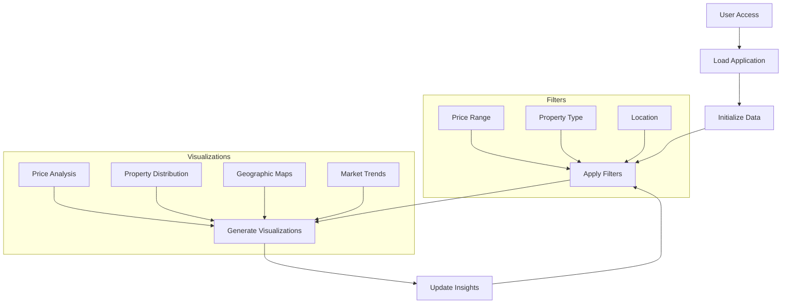
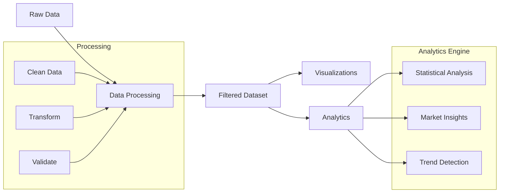
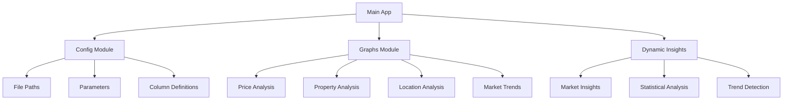
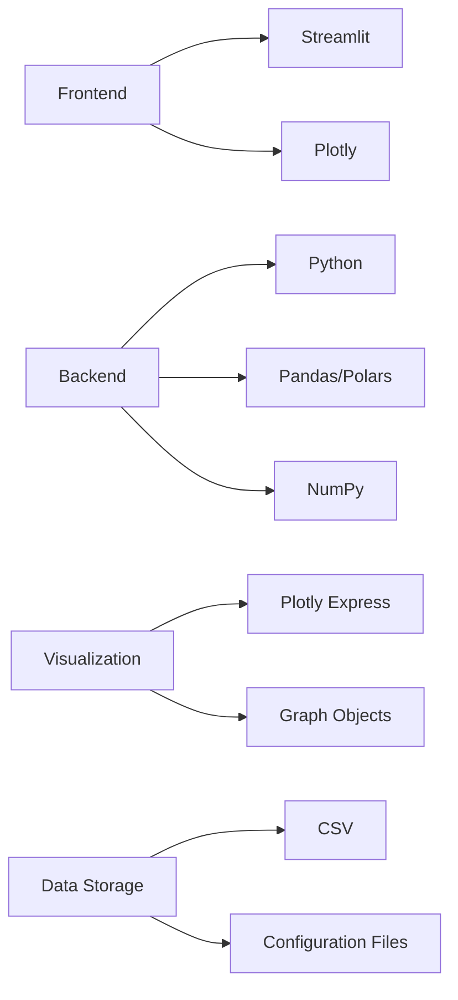

# US Real Estate Market Analysis Dashboard

## Overview
This Streamlit-powered dashboard provides comprehensive analysis and insights into the US real estate market. The application offers interactive visualizations, dynamic filtering, and automated market insights to help users make data-driven decisions in real estate.

## Application Flow



## Data Processing Architecture



## Component Architecture



## Features

### 1. Interactive Filtering
- Price range selection
- Property type filtering
- Geographic filtering (State and City level)
- Real-time visualization updates

### 2. Market Overview
- Median Property Price
- Median Price per Square Foot
- Active Listings Count
- Market Trend Indicators

### 3. Data Analysis Components

#### Price Analysis
- Price distribution histograms
- Price range distribution
- Price per square foot analysis

#### Property Analysis
- Property type distribution
- Bedroom/bathroom configurations
- Square footage analysis
- Amenities impact analysis

#### Location Analysis
- State-level price choropleth map
- Geographic price distribution
- Regional market trends

#### Market Dynamics
- Price trends over time
- Days on market analysis
- Property status distribution

### 4. Dynamic Insights Engine
- Automated market insights
- Trend identification
- Comparative analysis
- Market opportunity detection

## Data Structure

### Property Information
- List price
- Price per square foot
- HOA fees
- Property tax
- Monthly costs

### Property Characteristics
- Square footage
- Bedrooms/bathrooms
- Year built
- Property type
- Lot size

### Location Data
- State
- City
- ZIP code
- Neighborhood type

### Additional Metrics
- Energy ratings
- School information
- Walk/transit scores
- Crime rate percentiles

## Technical Stack



## Use Cases

### Market Research
- Track price trends
- Identify market opportunities
- Analyze regional variations

### Property Comparison
- Compare property types
- Analyze price/sqft metrics
- Evaluate amenity impact

### Investment Analysis
- Monitor market dynamics
- Identify high-value areas
- Analyze price-to-feature relationships

### Market Intelligence
- Access automated insights
- Track market changes
- Identify patterns

## Getting Started

1. Install dependencies:
```bash
pipenv install
```

2. Run the application:
```bash
pipenv run streamlit run app.py
```

## Dependencies
- streamlit>=1.27.0
- pandas>=2.0.0
- numpy>=1.24.0
- plotly-express>=0.4.1
- plotly>=5.17.0
- polars==0.20.5
- matplotlib
- seaborn

## Configuration
The application uses a configuration module for managing:
- File paths
- Data column definitions
- Visualization parameters
- Analysis settings

## Contributing
Contributions are welcome! Please feel free to submit a Pull Request. 